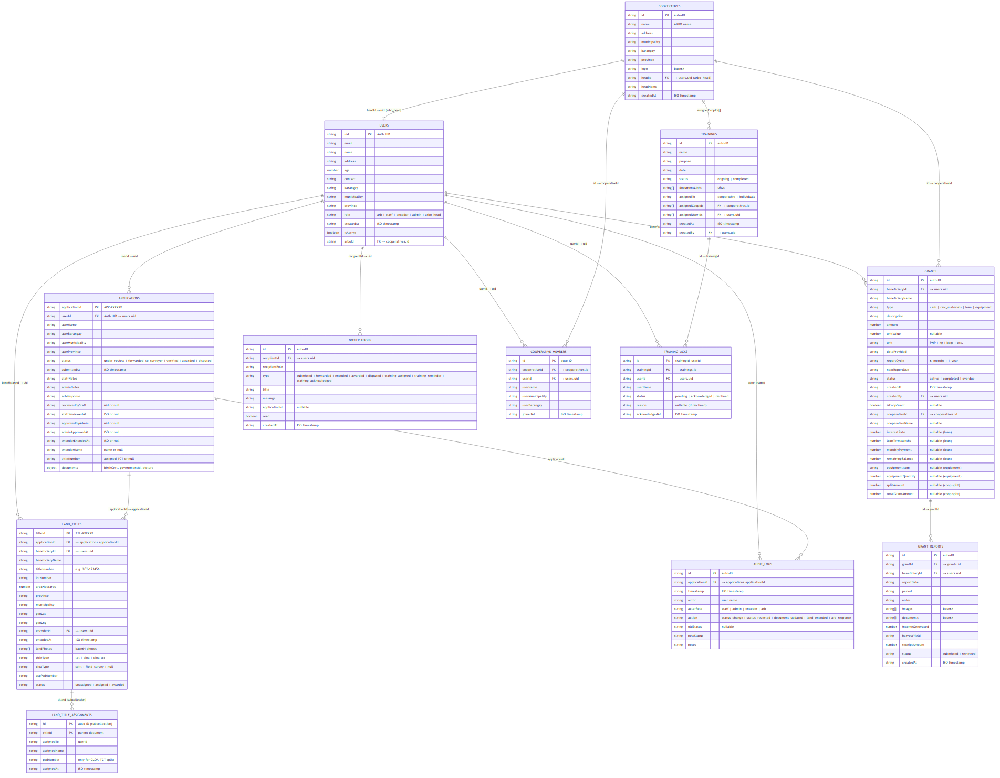
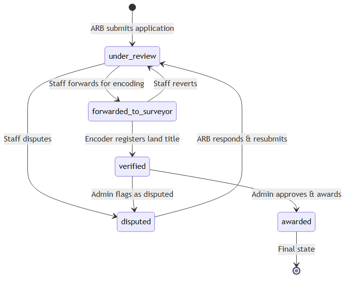
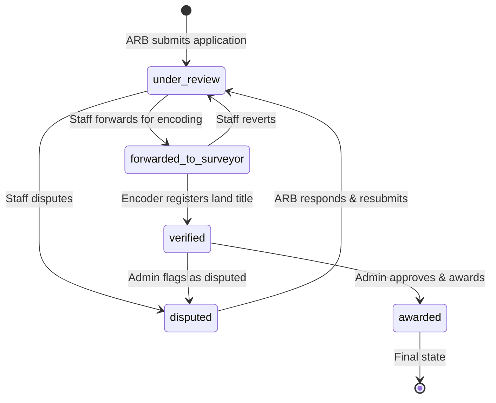

# ARBO App — Entity Relationship Diagram (ERD)

> **Firestore is a NoSQL database**, so there are no foreign-key constraints enforced at the database level. Relationships below are **logical** — they exist in application code via document IDs, collection references, and query filters.

---

## 📊 Rendered ERD

> You can also open this file in VS Code and press `Ctrl+Shift+V` (Markdown Preview) to see the interactive Mermaid diagram below.

```mermaid
erDiagram
    USERS ||--o{ APPLICATIONS : "userId → uid"
    USERS ||--o{ LAND_TITLES : "beneficiaryId → uid"
    USERS ||--o{ GRANTS : "beneficiaryId → uid"
    USERS ||--o{ NOTIFICATIONS : "recipientId → uid"
    USERS ||--o{ COOPERATIVE_MEMBERS : "userId → uid"
    USERS ||--o{ TRAINING_ACKS : "userId → uid"
    USERS ||--o{ AUDIT_LOGS : "actor (name)"

    COOPERATIVES ||--o{ COOPERATIVE_MEMBERS : "id → cooperativeId"
    COOPERATIVES ||--o{ GRANTS : "id → cooperativeId"
    COOPERATIVES ||--o{ TRAININGS : "assignedCoopIds[]"
    COOPERATIVES ||--|| USERS : "headId → uid (arbo_head)"

    APPLICATIONS ||--o{ LAND_TITLES : "applicationId → applicationId"
    APPLICATIONS ||--o{ AUDIT_LOGS : "applicationId"

    LAND_TITLES ||--o{ LAND_TITLE_ASSIGNMENTS : "titleId (subcollection)"

    TRAININGS ||--o{ TRAINING_ACKS : "id → trainingId"

    GRANTS ||--o{ GRANT_REPORTS : "id → grantId"

    USERS {
        string uid PK "Auth UID"
        string email
        string name
        string address
        number age
        string contact
        string barangay
        string municipality
        string province
        string role "arb | staff | encoder | admin | arbo_head"
        string createdAt "ISO timestamp"
        boolean isActive
        string arboId "FK → cooperatives.id"
    }

    APPLICATIONS {
        string applicationId PK "APP-XXXXXX"
        string userId FK "Auth UID → users.uid"
        string userName
        string userBarangay
        string userMunicipality
        string userProvince
        string status "under_review | forwarded_to_surveyor | verified | awarded | disputed"
        string submittedAt "ISO timestamp"
        string staffNotes
        string adminNotes
        string arbResponse
        string reviewedByStaff "uid or null"
        string staffReviewedAt "ISO or null"
        string approvedByAdmin "uid or null"
        string adminApprovedAt "ISO or null"
        string encoderEncodedAt "ISO or null"
        string encoderName "name or null"
        string titleNumber "assigned TCT or null"
        object documents "birthCert, governmentId, picture"
    }

    LAND_TITLES {
        string titleId PK "TTL-XXXXXX"
        string applicationId FK "→ applications.applicationId"
        string beneficiaryId FK "→ users.uid"
        string beneficiaryName
        string titleNumber "e.g. TCT-123456"
        string lotNumber
        number areaHectares
        string province
        string municipality
        string geoLat
        string geoLng
        string encoderId FK "→ users.uid"
        string encodedAt "ISO timestamp"
        string[] landPhotos "base64 photos"
        string titleType "tct | cloa | cloa-tct"
        string cloaType "split | field_survey | null"
        string aspPsdNumber
        string status "unassigned | assigned | awarded"
    }

    LAND_TITLE_ASSIGNMENTS {
        string id PK "auto-ID (subcollection)"
        string titleId PK "parent document"
        string assignedTo "userId"
        string assignedName
        string psdNumber "only for CLOA-TCT splits"
        string assignedAt "ISO timestamp"
    }

    AUDIT_LOGS {
        string id PK "auto-ID"
        string applicationId FK "→ applications.applicationId"
        string timestamp "ISO timestamp"
        string actor "user name"
        string actorRole "staff | admin | encoder | arb"
        string action "status_change | status_reverted | document_updated | land_encoded | arb_response"
        string oldStatus "nullable"
        string newStatus
        string notes
    }

    NOTIFICATIONS {
        string id PK "auto-ID"
        string recipientId FK "→ users.uid"
        string recipientRole
        string type "submitted | forwarded | encoded | awarded | disputed | training_assigned | training_reminder | training_acknowledged"
        string title
        string message
        string applicationId "nullable"
        boolean read
        string createdAt "ISO timestamp"
    }

    COOPERATIVES {
        string id PK "auto-ID"
        string name "ARBO name"
        string address
        string municipality
        string barangay
        string province
        string logo "base64"
        string headId FK "→ users.uid (arbo_head)"
        string headName
        string createdAt "ISO timestamp"
    }

    COOPERATIVE_MEMBERS {
        string id PK "auto-ID"
        string cooperativeId FK "→ cooperatives.id"
        string userId FK "→ users.uid"
        string userName
        string userMunicipality
        string userBarangay
        string joinedAt "ISO timestamp"
    }

    GRANTS {
        string id PK "auto-ID"
        string beneficiaryId FK "→ users.uid"
        string beneficiaryName
        string type "cash | raw_materials | loan | equipment"
        string description
        number amount
        number unitValue "nullable"
        string unit "PHP | kg | bags | etc."
        string dateProvided
        string reportCycle "6_months | 1_year"
        string nextReportDue
        string status "active | completed | overdue"
        string createdAt "ISO timestamp"
        string createdBy FK "→ users.uid"
        boolean isCoopGrant "nullable"
        string cooperativeId FK "→ cooperatives.id"
        string cooperativeName "nullable"
        number interestRate "nullable (loan)"
        number loanTermMonths "nullable (loan)"
        number monthlyPayment "nullable (loan)"
        number remainingBalance "nullable (loan)"
        string equipmentItem "nullable (equipment)"
        number equipmentQuantity "nullable (equipment)"
        number splitAmount "nullable (coop split)"
        number totalGrantAmount "nullable (coop split)"
    }

    USERS ||--o{ LOANS : "applicantId → uid"
    COOPERATIVES ||--o{ LOANS : "cooperativeId"
    LOANS ||--o{ LOAN_PAYMENTS : "loanId"
    USERS ||--o{ LOAN_PAYMENTS : "applicantId → uid"
    USERS ||--o{ LOAN_INCOME_EXPENSES : "userId → uid"

    LOANS {
        string id "Logical LOAN-XXXXXX identifier"
        string firestoreId PK "Firestore auto-document ID (runtime mapping)"
        string applicantId FK "→ users.uid"
        string applicantName
        string applicantType "individual | cooperative"
        string cooperativeId FK "nullable → cooperatives.id"
        string cooperativeName "nullable"
        object[] memberAllocations "cooperative memberId, memberName, amount"
        number principalAmount
        number interestRate
        number termMonths
        string paymentFrequency "monthly | quarterly | semi_annual | annual"
        string purpose
        number totalInterest
        number totalRepayment
        number installmentAmount
        number numberOfPayments
        string status "pending_approval | needs_review | active | completed | rejected | defaulted"
        string accountStatus "open | closed"
        number totalPaid
        number remainingBalance
        number defaultedPayments
        number onTimePayments
        string nextPaymentDue
        boolean hasHistoryFlag
        string historyNotes
        string approvedBy "nullable → users.uid"
        string approvedAt "ISO or null"
        string rejectedReason "nullable"
        string previousRejectedReason "latest historical rejection"
        string resubmissionNotes "nullable"
        string resubmittedAt "ISO or null"
        string notes
        string startDate
        string createdBy FK "→ users.uid"
        string createdAt
        string updatedAt
    }

    LOAN_PAYMENTS {
        string id PK "auto-ID"
        string loanId FK "→ loans.id"
        string applicantId FK "→ users.uid"
        string memberId FK "nullable → users.uid; cooperative payment owner"
        string memberName "nullable; cooperative payment owner display name"
        boolean isEarlyRepayment "nullable; full member-share payoff request"
        number paymentNumber
        string dueDate
        number amountDue
        number amountPaid
        string status "upcoming | paid | overdue | partial | disputed"
        string paidAt
        string paidBy FK "nullable → users.uid"
        string paidByName
        string receiptImage "Supabase public URL"
        string receiptNotes
        string disputeReason "active dispute reason"
        string lastDisputeReason "latest historical dispute reason"
        string disputedAt "ISO or null"
        string disputedBy FK "nullable → users.uid"
        string resubmittedAt "ISO or null"
        string resubmissionNotes
        string verifiedBy FK "→ users.uid or ARBO head"
        string verifiedByName
        string verifiedAt
        string createdAt
    }

    LOAN_INCOME_EXPENSES {
        string id PK "auto-ID"
        string userId FK "→ users.uid"
        string userName
        string type "income | expense"
        string category
        string description
        number amount
        string date
        string loanId FK "nullable → loans.id; scopes ledger entry to one loan"
        string receiptImage "Supabase public URL or null"
        string createdAt
        string createdBy FK "→ users.uid"
    }

    GRANT_REPORTS {
        string id PK "auto-ID"
        string grantId FK "→ grants.id"
        string beneficiaryId FK "→ users.uid"
        string reportDate
        string period
        string notes
        string[] images "base64"
        string[] documents "base64"
        number incomeGenerated
        string harvestYield
        number receiptAmount
        string status "submitted | reviewed"
        string createdAt "ISO timestamp"
    }

    TRAININGS {
        string id PK "auto-ID"
        string name
        string purpose
        string date
        string status "ongoing | completed"
        string[] documentLinks "URLs"
        string assignedTo "cooperative | individuals"
        string[] assignedCoopIds "FK → cooperatives.id"
        string[] assignedUserIds "FK → users.uid"
        string createdAt "ISO timestamp"
        string createdBy FK "→ users.uid"
    }

    TRAINING_ACKS {
        string id PK "trainingId_userId"
        string trainingId FK "→ trainings.id"
        string userId FK "→ users.uid"
        string userName
        string status "pending | acknowledged | declined"
        string reason "nullable (if declined)"
        string acknowledgedAt "ISO timestamp"
    }
```

---

## 🔗 Entity Relationships Summary

| #   | From                     | To                              | Type     | Via                                                       |
| --- | ------------------------ | ------------------------------- | -------- | --------------------------------------------------------- |
| 1   | **users**                | **applications**                | 1 → many | `applications.userId` = `users.uid`                       |
| 2   | **users**                | **landTitles**                  | 1 → many | `landTitles.beneficiaryId` = `users.uid`                  |
| 3   | **users**                | **grants**                      | 1 → many | `grants.beneficiaryId` = `users.uid`                      |
| 4   | **users**                | **notifications**               | 1 → many | `notifications.recipientId` = `users.uid`                 |
| 5   | **users**                | **cooperativeMembers**          | 1 → many | `cooperativeMembers.userId` = `users.uid`                 |
| 6   | **users**                | **trainingAcks**                | 1 → many | `trainingAcks.userId` = `users.uid`                       |
| 7   | **users**                | **auditLogs**                   | 1 → many | `auditLogs.actor` = `users.name` (logical)                |
| 8   | **users** (as arbo_head) | **cooperatives**                | 1 → 1    | `cooperatives.headId` = `users.uid`                       |
| 9   | **cooperatives**         | **cooperativeMembers**          | 1 → many | `cooperativeMembers.cooperativeId` = `cooperatives.id`    |
| 10  | **cooperatives**         | **grants**                      | 1 → many | `grants.cooperativeId` = `cooperatives.id`                |
| 11  | **cooperatives**         | **trainings**                   | 1 → many | `trainings.assignedCoopIds[]` contains `cooperatives.id`  |
| 12  | **applications**         | **landTitles**                  | 1 → many | `landTitles.applicationId` = `applications.applicationId` |
| 13  | **applications**         | **auditLogs**                   | 1 → many | `auditLogs.applicationId` = `applications.applicationId`  |
| 14  | **landTitles**           | **landTitles/{id}/assignments** | 1 → many | Subcollection for CLOA-TCT split tracking                 |
| 15  | **trainings**            | **trainingAcks**                | 1 → many | `trainingAcks.trainingId` = `trainings.id`                |
| 16  | **grants**               | **grantReports**                | 1 → many | `grantReports.grantId` = `grants.id`                      |
| 17  | **users**                | **loans**                     | 1 → many | `loans.applicantId` = `users.uid`                         |
| 18  | **cooperatives**         | **loans**                     | 1 → many | `loans.cooperativeId` = `cooperatives.id`                 |
| 19  | **loans**                | **loanPayments**              | 1 → many | `loanPayments.loanId` = logical `loans.id`                |
| 20  | **users**                | **loanIncomeExpenses**        | 1 → many | `loanIncomeExpenses.userId` = `users.uid`                 |

---

## 🗂️ Collection Details

### `/users/{uid}` (12 collections → related)

The central entity. All other collections reference back to users via `userId`, `beneficiaryId`, `recipientId`, or `actor`.

### `/applications/{applicationId}`

- Each ARB farmer has **one active application** linked by their `uid`.
- Status drives the **approval workflow**.
- Documents are stored as Base64 strings directly in the document.

### `/landTitles/{titleId}`

- Created by **encoder** role.
- Supports 3 `titleType` values: `tct`, `cloa`, `cloa-tct`.
- `cloaType` (`split` | `field_survey`) is conditional on `cloa-tct`.
- Has a **subcollection** `/assignments/` for tracking CLOA-TCT split assignments.

### `/auditLogs/{autoId}`

- Immutable — never deleted or updated.
- Tracks government-relevant workflow actions across applications, land titles,
  loans, payments, cooperative reviews, and account administration.
- Core fields include `actorId`, `actor`, `actorRole`, `action`, `entityType`,
  `entityId`, optional `applicationId`, `oldStatus`, `newStatus`, `notes`, and
  an ISO `timestamp`.

### `/notifications/{autoId}`

- Real-time notifications via Firestore `onSnapshot`.
- Targeted by `recipientId` (direct) or `recipientRole` (broadcast).
- Types cover both **CLOA workflow** and **training** events.

### `/cooperatives/{id}` (a.k.a. ARBOs)

- Each cooperative has a `headId` linking to an `arbo_head` user.
- Members are stored in a **separate** `/cooperativeMembers/` collection (not a subcollection) for cross-querying.

### `/cooperativeMembers/{id}`

- Tracks which users belong to which cooperative.
- Used by GrantManagement (coop grant splits) and ArboDashboard.

### `/grants/{id}`

- 4 types: `cash`, `raw_materials`, `loan`, `equipment`.
- Type-specific fields (`interestRate`, `equipmentItem`, `splitAmount`, etc.) are optional/nullable.
- Supports both **individual** (single ARB) and **cooperative** (split across members) grants.

### `/grantReports/{id}`

- ARBs submit reports against their grants.
- Contains income, harvest yield, receipt amounts, and supporting images/documents.

### `/trainings/{id}`

- Admin creates trainings, assigns to cooperatives or individuals.
- Document links are stored as string arrays.

### `/trainingAcknowledgments/{trainingId}_{userId}`

- Composite key ID format: `{trainingId}_{userId}`.
- Tracks RSVP status: `pending` → `acknowledged` | `declined`.

### Loan identity and payment review

- A loan has a human-readable logical ID such as `LOAN-123456` in its data and
  a separate Firestore document ID. Runtime loan objects expose the latter as
  `firestoreId`; loan updates must use `firestoreId || id` as the document path.
- Applicant receipts are uploaded through `src/utils/storage.ts` to the public
  Supabase `uploads` bucket. Firestore stores the returned URL in
  `loanPayments.receiptImage`.
- A disputed payment never reduces the loan balance. The applicant can submit a
  replacement receipt and notes, after which an admin or eligible ARBO Head must
  verify it before totals change.

---

## 📐 Indexed Queries (Require Firestore Composite Indexes)

These queries use `where` + `orderBy` on different fields and need composite indexes:

| Query                | Collection      | Filter                              | Order                         |
| -------------------- | --------------- | ----------------------------------- | ----------------------------- |
| User's notifications | `notifications` | `where("recipientId","==",uid)`     | `orderBy("createdAt","desc")` |
| User's grants        | `grants`        | `where("beneficiaryId","==",uid)`   | (implicit)                    |
| ARBO's grants        | `grants`        | `where("cooperativeId","==",id)`    | (implicit)                    |
| User's applications  | `applications`  | `where("userId","==",uid)`          | (implicit)                    |
| Unassigned titles    | `landTitles`    | `where("status","==","unassigned")` | (implicit)                    |

---

## 🧭 Approval Workflow (Status Flow)

---

## 🛠️ Using This ERD

### In VS Code (Mermaid Preview)

1. Open this file
2. Press `Ctrl+Shift+V` to open Markdown Preview
3. The Mermaid diagram renders automatically

### With an ERD Tool (PlantUML, Draw.io, etc.)

The Mermaid `erDiagram` block above can be pasted into any Mermaid-compatible tool (Mermaid Live Editor, Notion, GitHub, etc.).

### For MySQL/PostgreSQL Schema Generation

If you ever migrate to a relational database, the entity/field definitions above provide a direct mapping. Note that `string[]` arrays and nested `object` fields would need junction tables.
