# Phase 17: Training Experience & Loan Management UI/UX Modernization — Worker Spec

> **Status**: ✅ COMPLETED (2026-09-30)
> **Created by**: Planner & Senior UI/UX Architect (2026-09-30)
> **Target Files**:
> - `src/pages/MyTrainings.tsx` (MODIFY)
> - `src/pages/TrainingManagement.tsx` (MODIFY)
> - `src/pages/ArboDashboard.tsx` (MODIFY)
> - `src/pages/LoanManagement.tsx` (MODIFY)
> - `src/pages/LoanApplication.tsx` (MODIFY)
> - `PROJECT_TASKS.md` (MODIFY)
> - `SESSION_HANDOVER.md` (MODIFY)
> **Prerequisites**: Read `GEMINI.md`, `PROJECT_CONTEXT.md`, `src/types/loan.ts`

---

## 1. Problem Statement & Client Pain Points

1. **Training Review & Past Materials**:
   - In `MyTrainings.tsx`, past trainings are static `<div>`s that cannot be clicked or opened. Users cannot review materials or confirm that they have viewed/read training documents post-session.
   - ARBO heads in `ArboDashboard.tsx` cannot easily see which members actually received/reviewed the training without scrolling through a raw list.
   - When Admin creates a training for ARB members, ARBO heads are often excluded unless specifically configured.

2. **Loan Management UI/UX (User, ARBO Head & Admin)**:
   - **No Search or Pagination on Massive Lists**: Tables with hundreds or thousands of loan records cannot be searched by borrower name, loan ID, or cooperative, and lack pagination.
   - **Missing Default Sorting**: Newly submitted loans/payments do not reliably sort newest first (`createdAt` descending).
   - **Lack of "1-Glance" Financial Insights**:
     - *ARB User*: Needs clear progress bars ("₱X of ₱Y paid"), payment countdown, and instant next-due action button.
     - *ARBO Head*: Needs a single cooperative health card and member loan search.
     - *Admin*: Needs quick borrower dossiers (lifetime loans, defaults, income/expenses) without navigating away.

---

## 2. Engineering Architecture & UI/UX Design

```mermaid
flowchart TD
    subgraph Trainings Enhancement
        A[Admin creates Training] -->|Target: All ARBs + ARBO Heads / Coop| B[Writes Training + Notifications to all assignees]
        B --> C[ARB / ARBO Head in MyTrainings]
        C -->|Upcoming| D[RSVP: Attending / Declined]
        C -->|Past / Completed| E[Open Detail Modal -> Review Docs -> Click 'Confirm Reviewed']
        E --> F[Updates trainingAcknowledgments status to 'acknowledged']
        F --> G[ARBO Head Dashboard shows engagement % & members list]
    end

    subgraph Loan Management UI/UX
        H[Admin / ARBO Head / User Table] -->|Default Sort: Newest First| I[Search Toolbar: Name, Loan ID, Coop, Status]
        I --> J[Clean Paginated Rows with Progress Badges]
        J --> K[1-Click Borrower Financial Dossier Modal]
        K --> L[Lifetime Borrowed, Repaid, Defaults, Ledger Profit]
    end
```



---

## 3. Step-by-Step Task List for Worker

---

### TASK 1: Upgrade `src/pages/MyTrainings.tsx` (Interactive Past Trainings & Post-Review Confirmation)
**File**: `src/pages/MyTrainings.tsx`
**Status**: [x]

#### What to change:
1. **Interactive Past Trainings**:
   - Replace static past training cards with clickable cards featuring an **"Open Materials & Review"** button.
2. **Training Detail & Materials Modal**:
   - Add state: `const [selectedTrainingForReview, setSelectedTrainingForReview] = useState<Training | null>(null);`
   - Modal displays:
     - Training Name, Purpose, Date, and Assigned Target badge.
     - **Learning Materials & Links**: Clean list of all `documentLinks` with icons and direct open links.
     - **Acknowledgment / Review Status**:
       - If already acknowledged: show green badge `"✓ Acknowledged on [date]"`.
       - If pending or unconfirmed: provide a prominent button **"Confirm I Have Reviewed & Read Training Materials"**.
3. **Handle Confirmation**:
   - On click, create/update `trainingAcknowledgments/${training.id}_${user.uid}` with:
     ```ts
     {
       trainingId: selectedTraining.id,
       userId: user.uid,
       userName: profile?.name || "ARB Member",
       status: "acknowledged",
       acknowledgedAt: new Date().toISOString(),
       reviewedNotes: "Confirmed review of training materials."
     }
     ```
   - Send notification to Admin (`type: "training_acknowledged"`).

---

### TASK 2: Upgrade `src/pages/TrainingManagement.tsx` (All Beneficiaries Target + Notifications)
**File**: `src/pages/TrainingManagement.tsx`
**Status**: [x]

#### What to change:
1. **Assignment Selector Options**:
   - In the create/edit training modal, support three clear assignment types:
     - `"all"`: All ARB Members and ARBO Heads.
     - `"cooperative"`: Specific Cooperatives.
     - `"individuals"`: Specific Selected Users.
2. **Include ARBO Heads Automatically when assigning to Cooperatives**:
   - When assigning to `cooperativeId`:
     - Query `cooperativeMembers` for that coop.
     - ALSO query `cooperatives` (doc for `coopId`) and include `headId`, OR query `users` where `arboId == coopId && role == "arbo_head"`.
     - Create pending acknowledgments for ALL members AND the ARBO Head.
3. **Dispatch Notifications on Training Creation**:
   - Loop through all assigned recipient IDs and write to `/notifications`:
     ```ts
     await addDoc(collection(db, "notifications"), {
       recipientId: uid,
       recipientRole: isHead ? "arbo_head" : "arb",
       type: "training_assigned",
       title: `New Training: ${formName}`,
       message: `You have been assigned to "${formName}" scheduled for ${formatDate(formDate)}.`,
       applicationId: null,
       read: false,
       createdAt: new Date().toISOString(),
     });
     ```
4. **Live Acknowledgment Table with Search & Filter**:
   - In expanded training view, add a quick search input to find any attendee by name, and a filter by status (`All`, `Attending`, `Pending`, `Declined`).

---

### TASK 3: Upgrade `src/pages/ArboDashboard.tsx` (TrainingsTab & LoansTab)
**File**: `src/pages/ArboDashboard.tsx`
**Status**: [x]

#### In `TrainingsTab`:
1. **Engagement Progress Bar**:
   - Calculate percentage: `Math.round((ackMembers.length / members.length) * 100) || 0`.
   - Display a visual progress bar with count: e.g., `18 of 24 members responded (75%)`.
2. **Filter & Search inside Training Card**:
   - Filter pills: `All (${members.length})`, `Attending (${ackCount})`, `Pending (${pendingCount})`, `Declined (${declinedCount})`.
   - Search input to filter member list by name.
3. **Bulk "Nudge All Pending"**:
   - Button at the top of the member status list: when clicked, sends notification reminders to all members who have not yet responded.

#### In `LoansTab`:
1. **Cooperative Financial Health Card**:
   - Total Active Member Loans.
   - Total Portfolio Balance.
   - Overall On-Time Repayment Rate (`(onTimePayments / totalPayments) * 100%`).
   - Delinquent Amount & Count.
2. **Search, Sort & Pagination for Member Loans Table**:
   - Search input: search by member name or loan ID.
   - Sort selector: Default **Newest First** (`createdAt` desc), Highest Remaining Balance, Most Defaults.
   - Pagination: 10 items per page with Prev/Next buttons.
3. **1-Click "Member Financial Dossier" Modal**:
   - Clicking any member's name opens a modal showing:
     - Member Name, Contact, Barangay.
     - All personal loans + cooperative allocations.
     - Payment history & receipts.
     - Income vs Expense ledger summary.

---

### TASK 4: Upgrade `src/pages/LoanManagement.tsx` (Admin Side Financial Control Center)
**File**: `src/pages/LoanManagement.tsx`
**Status**: [x]

#### What to change:
1. **Default Sorting & Ordering**:
   - All queries and lists (`loans`, `payments`, `incomeExpenses`) must sort **Newest First (`createdAt` descending)** by default:
     ```ts
     const sortedLoans = useMemo(() => {
       return [...loans].sort((a, b) => new Date(b.createdAt || 0).getTime() - new Date(a.createdAt || 0).getTime());
     }, [loans]);
     ```
2. **Global Search & Filter Bar**:
   - Search across Borrower Name, Loan ID (`LOAN-XXXXXX`), Cooperative Name, and Purpose.
   - Status Filter Pills: `All`, `Pending Approval`, `Active`, `Needs Review`, `Defaulters`, `Completed`, `Rejected`.
   - Sort dropdown: `Newest First`, `Oldest First`, `Highest Amount`, `Highest Remaining Balance`.
3. **Table Pagination (10 / 25 / 50 per page)**:
   - Prevent DOM bloat and scroll fatigue when thousands of loans exist.
   - Add pagination controls (`Page X of Y`, Previous, Next).
4. **1-Click Borrower Financial Dossier Modal**:
   - In every loan card or row, clicking the borrower's name opens a **Borrower 360° Dossier**:
     - Lifetime Stats: Total Borrowed, Total Repaid, Outstanding Debt, Default Count.
     - Past Loans List with status badges.
     - Income vs Expenses summary (Net Profit indicator).
     - Link to view their land title/CLOA record.
5. **Search & Sort in Sub-Tabs**:
   - In `payments` tab: search by borrower/loan ID, sort newest payment first.
   - In `defaulters` tab: search by borrower/coop, sort by overdue days descending.
   - In `reports` (profitability): search by borrower name, sort by net profit.

---

### TASK 5: Upgrade `src/pages/LoanApplication.tsx` (ARB & Coop Member User Experience)
**File**: `src/pages/LoanApplication.tsx`
**Status**: [x]

#### What to change:
1. **Default Sorting**:
   - `personalLoans` and `cooperativeLoans` sorted **Newest First** (`createdAt` descending) so new applications immediately show at the top.
2. **Active Loan Visual Health Card (Hero Widget)**:
   - Prominently display at the top of the "My Loans" tab for active loans:
     - Visual progress bar: `₱45,000 paid of ₱60,000 total (75%)`.
     - Installments badge: `9 of 12 payments completed`.
     - **Next Payment Due Highlight**: Large banner showing `"Next Payment: ₱5,000 due on [date]"` with an immediate **"Make Payment"** button right there!
3. **Lifetime Financial Track Record Snapshot**:
   - Compact summary card: `Lifetime Borrowed: ₱X · Total Repaid: ₱Y · Completed Loans: Z`.
4. **Search & Status Filter for Loans**:
   - Quick search input (by Loan ID or purpose).
   - Filter pills: `All`, `Active`, `Pending`, `Completed`.
5. **Income & Expenses Ledger UX Upgrade**:
   - Visual balance bar: Total Income (green) vs Total Expenses (slate) with Net Profit result.
   - Category search/filter buttons (e.g. `All`, `Harvest Sale`, `Fertilizer`, `Seeds`, `Labor`).

---

### TASK 6: Update Documentation & Verification
**Files**: `PROJECT_TASKS.md`, `SESSION_HANDOVER.md`
**Status**: [x]

1. Add Phase 17 to `PROJECT_TASKS.md` with tasks 17.1 to 17.15.
2. Update `SESSION_HANDOVER.md` documenting the new training review workflow, universal search/sort, and borrower dossier.
3. Run `npm run build` and ensure **0 TypeScript errors**.

---

## 4. Verification Checklist

- [x] `npm run build` passes with 0 errors.
- [x] In `MyTrainings.tsx`, past trainings can be clicked to open detail modal.
- [x] Users can click "Confirm I Have Reviewed & Read Training Materials" on past trainings.
- [x] In `TrainingManagement.tsx`, assigning a cooperative includes both members and the ARBO Head.
- [x] In `ArboDashboard.tsx`, Trainings tab shows progress bar, member search, and "Nudge All Pending".
- [x] In `ArboDashboard.tsx`, Loans tab has search by member, newest-first default sort, and pagination.
- [x] In `LoanManagement.tsx`, all loans default to newest first, with live search across name/ID/coop and pagination.
- [x] Clicking a borrower name opens the 360° Financial Dossier modal.
- [x] In `LoanApplication.tsx`, newest loans are at the top, and active loan shows visual progress bar with prominent next payment CTA.

> Verification note: `npm run build` passes with zero TypeScript errors.
> Vite continues to report the pre-existing large-bundle and ineffective
> Firebase dynamic-import warnings. Browser/Firebase data QA remains a
> deployment-environment concern rather than a compile-time blocker.
